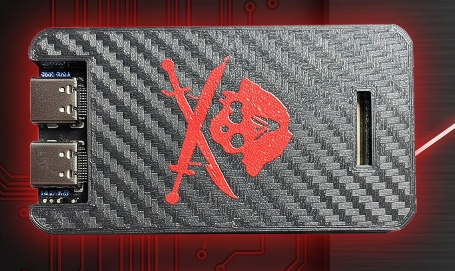

# 🏴‍☠️ Jolly BUS Pirate

**Multi-protocol hardware interface — ESP32-S3 N16R8, dual USB-C**

The **Jolly BUS Pirate** is a hand-built multi-protocol hardware interface from P01yg107 Labs. It speaks the languages chips use to talk to each other — **UART, I²C, and SPI** — so you can connect to a board, read a chip's memory, sniff traffic, and map how a device works. It's the core tool for learning hardware hacking, and the intended solve tool for our 7 Seas CTF badge.

🛒 **Buy one:** https://p01ylabs.com  ·  ▶ **Demo:** https://youtu.be/9H1rF5poRpU  ·  🏷️ **$35.00**

> ⚠️ **For education and authorized testing only.** See [docs/SAFETY.md](docs/SAFETY.md).

---

## Specs

| | |
|---|---|
| Board | ESP32-S3 DevKitC N16R8 (16 MB flash / 8 MB PSRAM), dual USB-C |
| Firmware | ESP32 Bit Pirate (geo-tp) |
| Protocols | UART, I²C, SPI and more (multi-mode) |
| Interface | Serial console over the UART/COM USB-C port at 115200 baud, or the web CLI |
| Companion app | esp32-bit-pirate-gui (Python/Tkinter desktop control panel) |
| Case | 3D-printed PETG-CF with a flush two-colour emblem |

## Quick start

1. Connect the Jolly BUS Pirate to your computer with a USB-C cable on the **UART/COM** port.
2. Open a serial console at **115200 baud** (or launch the Bit Pirate GUI).
3. Wire the probe leads to the target board **you own** (UART/I²C/SPI pins).
4. Pick a mode and start reading/scanning the bus.

Full walkthrough: **[docs/SETUP.md](docs/SETUP.md)** · Usage & examples: **[docs/USAGE.md](docs/USAGE.md)** · Problems: **[docs/TROUBLESHOOTING.md](docs/TROUBLESHOOTING.md)**

## Firmware & credits

- **[ESP32 Bit Pirate](https://github.com/geo-tp/ESP32-Bus-Pirate)** — the multi-protocol firmware the device runs (MIT)
- **[esp32-bit-pirate-gui](https://github.com/p0lygl07/esp32-bit-pirate-gui)** — our free desktop control panel for it

This repo is the product documentation and companion material. Where upstream firmware is
used, please support and star the upstream project; firmware issues belong upstream.

## About P01yg107 Labs

Hand-built hardware for people learning offensive security. Every device is flashed and
bench-tested before it ships.

🌐 https://p01ylabs.com  ·  🐙 https://github.com/p0lygl07

---

© 2026 Joshua Burton (P01yg107 Labs). Documentation and original files licensed under the MIT License (see [LICENSE](LICENSE)).
Any upstream firmware remains the property of its respective authors, under their own licenses.
